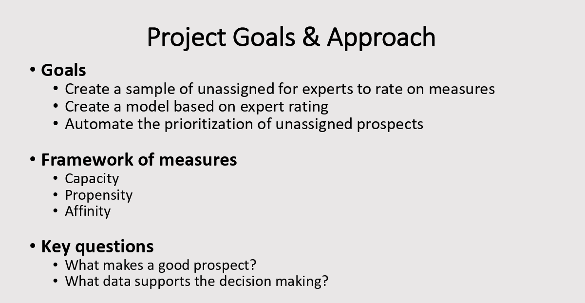
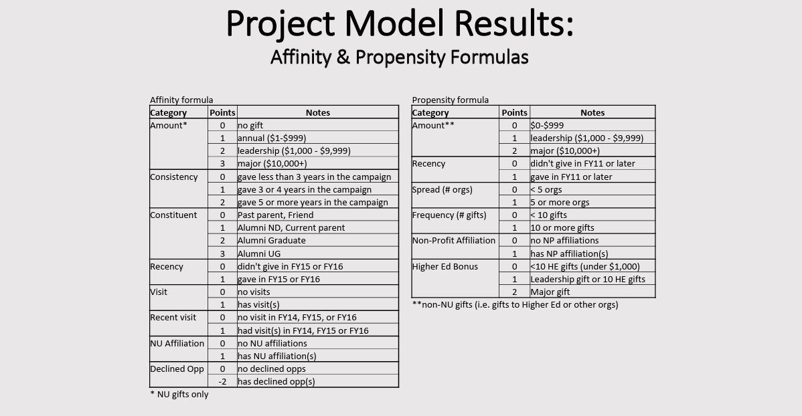
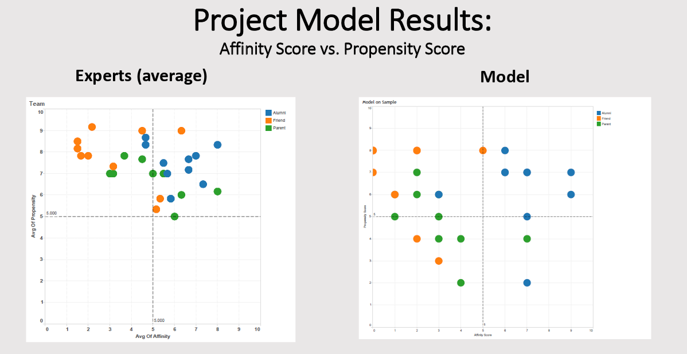
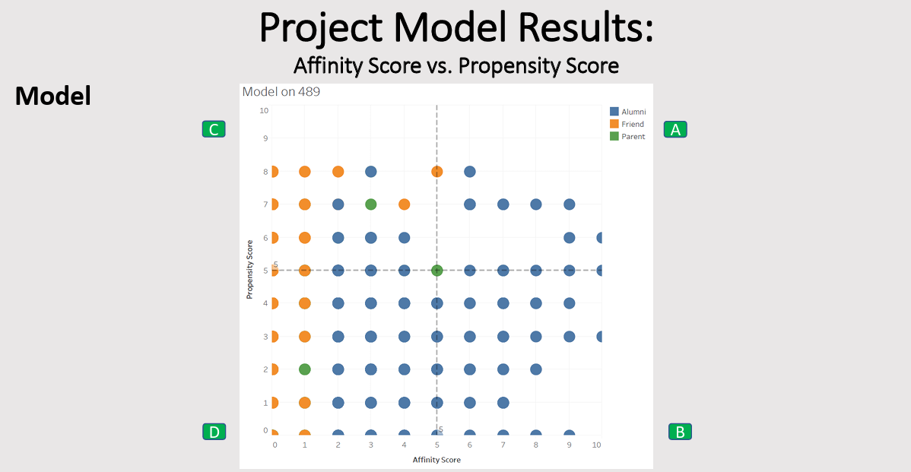
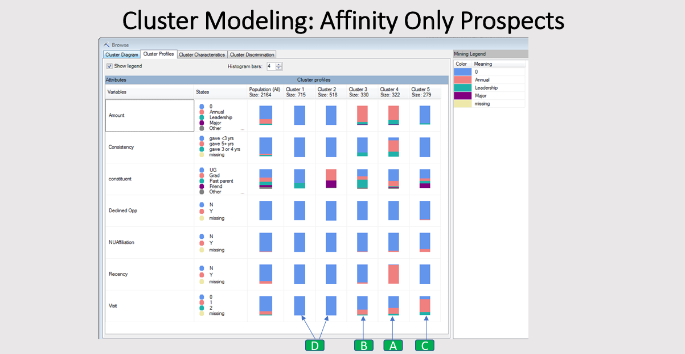

# Next Best Prospect Scoring Model — Northeastern University

## Project Overview
End-to-end prospect prioritization system designed to help the
Major Giving team identify and rank approximately 3,000 unassigned
donor prospects without requiring manual re-research.

## Methodology
Two composite scores developed and validated against expert ratings:

**Affinity Score** (internal CRM data, scale 0–13)
Measures depth of connection to Northeastern across 8 components:
gift amount, giving consistency, recency, constituent type,
personal visits, recent visits, NU affiliations, and a penalty
for declined solicitation opportunities.

**Propensity Score** (external giving data, scale 0–8)
Measures general philanthropic behavior across 6 components:
external gift size, recency, breadth of giving, frequency,
nonprofit affiliation, and higher education giving bonus.

## Prospect Grading
Cluster model output mapped to letter grades A–D.
Grade A = highest priority prospects for MGO assignment.
Results written back to Salesforce as part of each
constituent's permanent record.

## Outcome
~3,000 prospects graded and prioritized automatically.
Model output validated against expert consensus ratings
before full deployment.

## Slides

## Skills Demonstrated
R · Cluster Modeling · Scoring Model Design · Expert Knowledge
Elicitation · CRM Data Analysis · MS Access · Salesforce Integration ·
Fundraising Analytics · Higher Education Advancement Strategy
